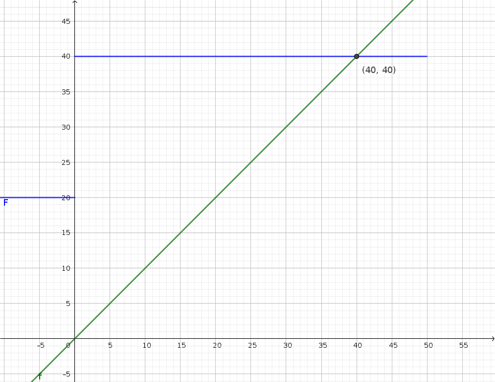
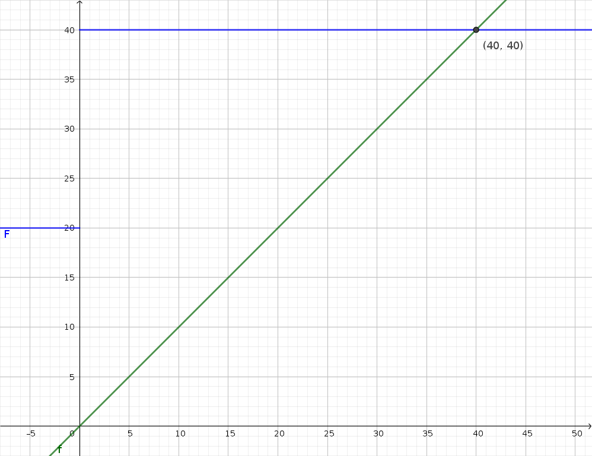

== Opgaver til modul 7

=== Opgave 4

Given a taskset:T1=50,c1=20,d1=60,T2=80,c2=20,d2=50(mS)

. Does utilization guarantee feasibility of an RMA schedule ?
. Validate an RMA schedule with the exact schedulability criterion.
. What is the optimal fixed priority schedule ?
. Validate the optimal fixed priority schedule with the exact
schedulability criterion.

==== Løsning

____
_Does utilization guarantee feasibility of an RMA schedule?_
____

Nej det kan man ikke.
Hvis deadlines havde været samme som periode kunne man regne stem:[\overline{U}] ud.
____
_Validate an RMA schedule with the exact schedulability criterion._
____

____
_What is the optimal fixed priority schedule ?_
____

Hvis alle deadlines er mindre end periode vil man sige at DMA er den bedste fixed priority.
Problemet er at task har en større deadline end dens periode, hvilket smadre der lidt.

Eftersom der kun er to er den eneste anden mulighed end den før DMA hvor man siger 1 -> 0.
Dette giver præcis det samme bare hvor de der byttet rundt.

____
_Exact schedulability criterion_
____

Dette giver også mening da, task altid vil vente på alle dem over den selv.
Derfor vil der i dette filfælde skulle ventes 19 for den sidste task.

Eftersom de begge har en complete tid på 20 vil de altid ende på t=40.
Dette er helt fint i begge tilfælde da ingen af dem har deadline inden 40.

