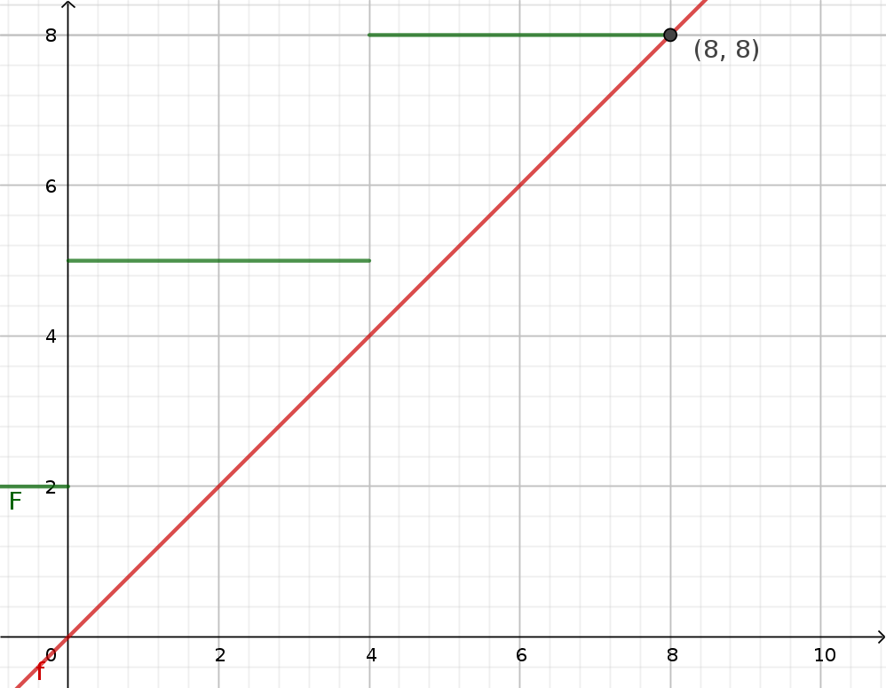
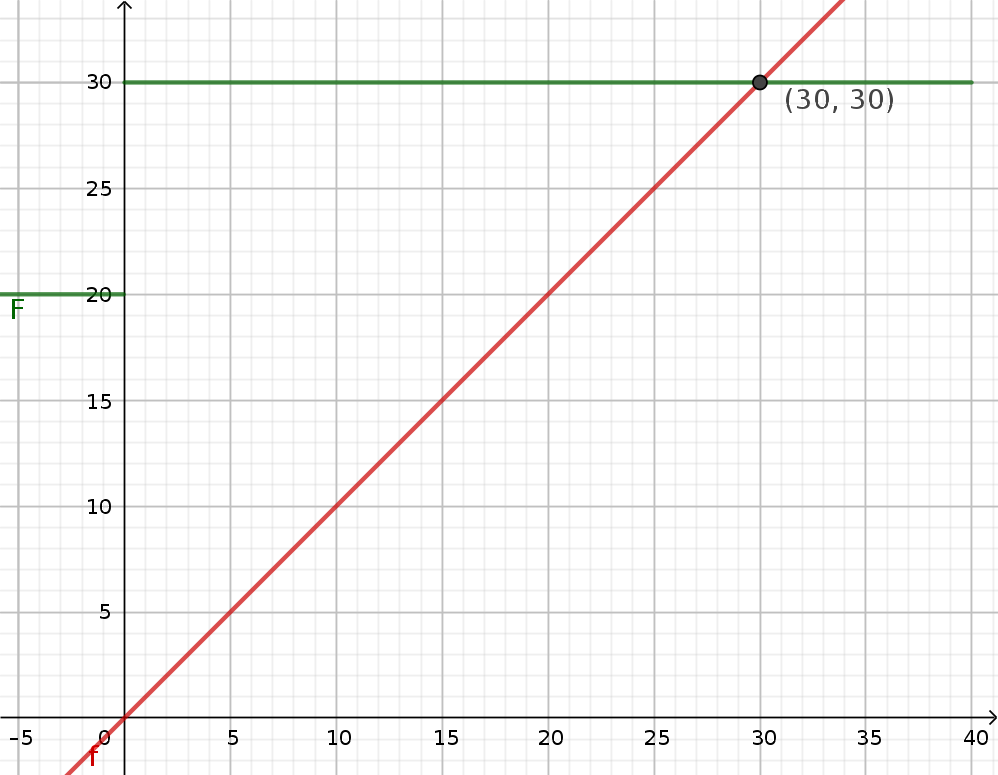
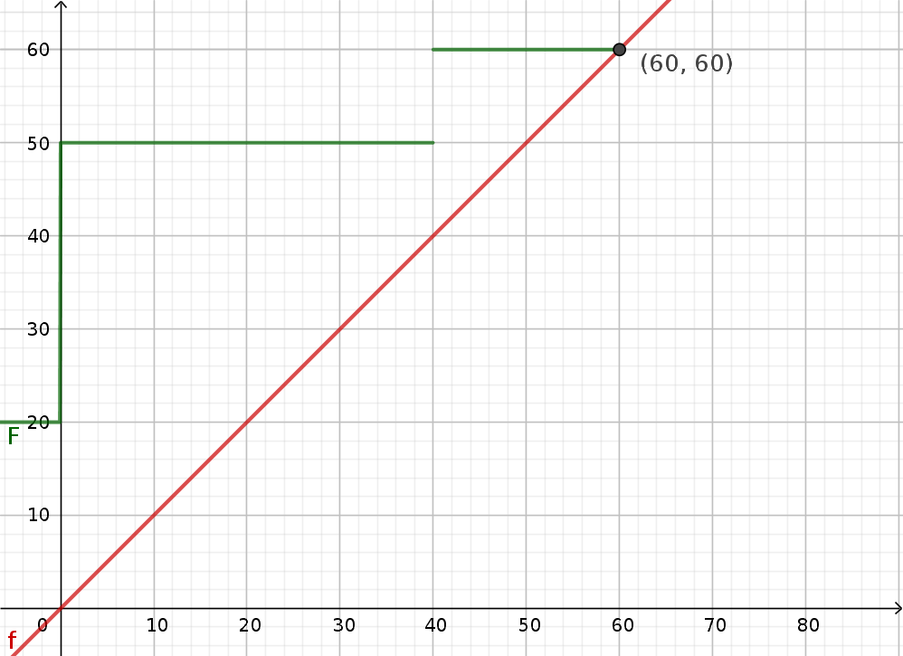

= Opgaver til gang 8

== Opgave 1

Given a periodic taskset : T1=4,c1=3,T2=12,c2=2 with relative deadlines d1=4,d2=7

. Examine the taskset w.r.t. schedulability using the exact criterion for DMA scheduling.  Is the taskset EDF schedulable ?

=== Løsning

____
_Examine the taskset w.r.t. schedulability using the exact criterion for DMA scheduling._
____

Her kan man se at følgende priority scheme skal bruges.

(T1, T2)

Nu giver det mening at undersøge om dette er feasable.
For T1 er completion time 3, hvilket er under dens deadline.

For T2.

Her kan man se at completion time er 8 hvilket er efter T2's deadline.
Derfor er DMA ikke feasable.

Dette kan man også se hvis man kører det.

----
0           3   2   4   7   
1   |       2   2   3   6   
2   |       1   2   2   5   
3   |       0   2   1   4   
4       |   3   1   4   3   
5   |       2   1   3   2   
6   |       1   1   2   1   
Deadline missed in task 1
----

____
Is the taskset EDF schedulable?
____

Når man kører med EDF kan man se at der ikke er mere arbejde efter LCM.

----
0           3   2   4   7   
1   |       2   2   3   6   
2   |       1   2   2   5   
3   |       0   2   1   4   
4       |   3   1   4   3   
5       |   3   0   3   2   
6   |       2   0   2   1   
7   |       1   0   1   0   
8   |       2   0   4   -1  
9   |       1   0   3   -2  
10  |       0   0   2   -3  
11          0   0   1   -4
----

== Opgave 2

Given a periodic taskset T1=40,c1=10,d1=20,T2=60,c2=20,d2=30,T3=80,c3=20,d3=80,(milliseconds) where task1 and task2 share data protected by semaphore S.
Accessing the shared data lasts no more than 10 (time units-mill sec).
Priority ceiling or immediate ceiling is assumed.

. Is the taskset DMA schedulable ?
. If the data above are instead shared between task1 and task3, is the taskset then DMA schedulable.

=== Løsning

____
_Is the taskset DMA schedulable?_
____

Her bruger jeg den nye formel for at finde completion time.

stem:[C_i = c_i + \sum_{j=1}{i-1}ceil(C_i/T_j) * c_j + B_i]

Ved DMA bliver prioriteten (T1, T2, T3).
Task 1 kan godt vente på T2, men T2 skal ikke vente på nogen.

----
C1 = 10 + 10 = 20
C2 = 20 + ceil(C2/40)*10
C3 = 20 + ceil(C3/60)*20 + ceil(C3/40)*10
----

T1 bliver færdig lige inden dens deadline.
Først plottes C2.

Her kan man se at den completer inden dens deadline 30.

Under kan man se at T3 også bliver færdig, når man plotter C3.

____
_If the data above are instead shared between task1 and task3, is the taskset then DMA schedulable._
____

Her ændres C1 til C3 sig overhovedet ikke, da T1 alligevel skal vente 10.

----
C1 = 10 + 10 = 20
C2 = 20 + ceil(C2/40)*10
C3 = 20 + ceil(C3/60)*20 + ceil(C3/40)*10
----

== Opgave 3

Implement the example of ex. 2) on JDN's kernel and measure worst case completion times.
