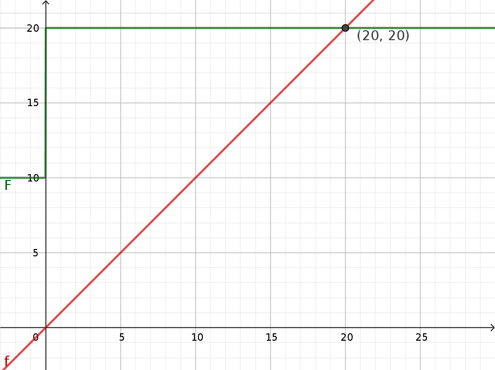
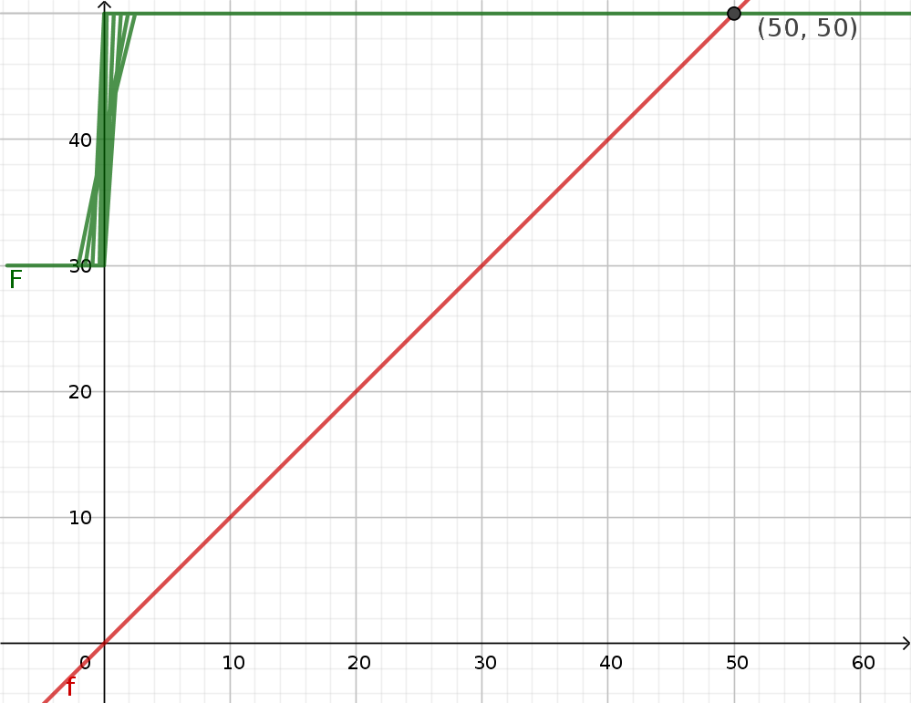
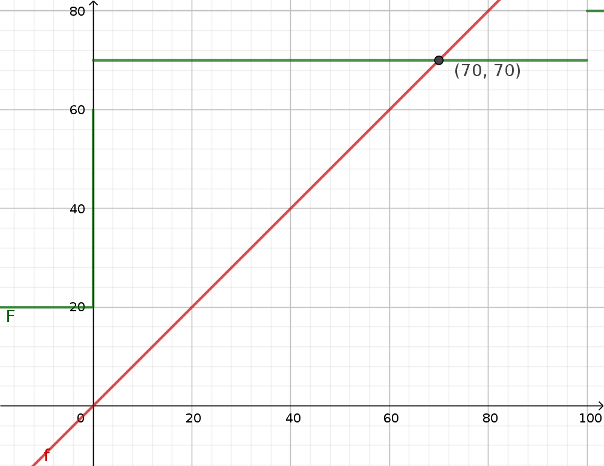
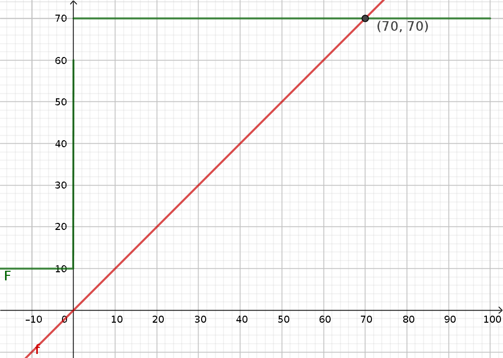
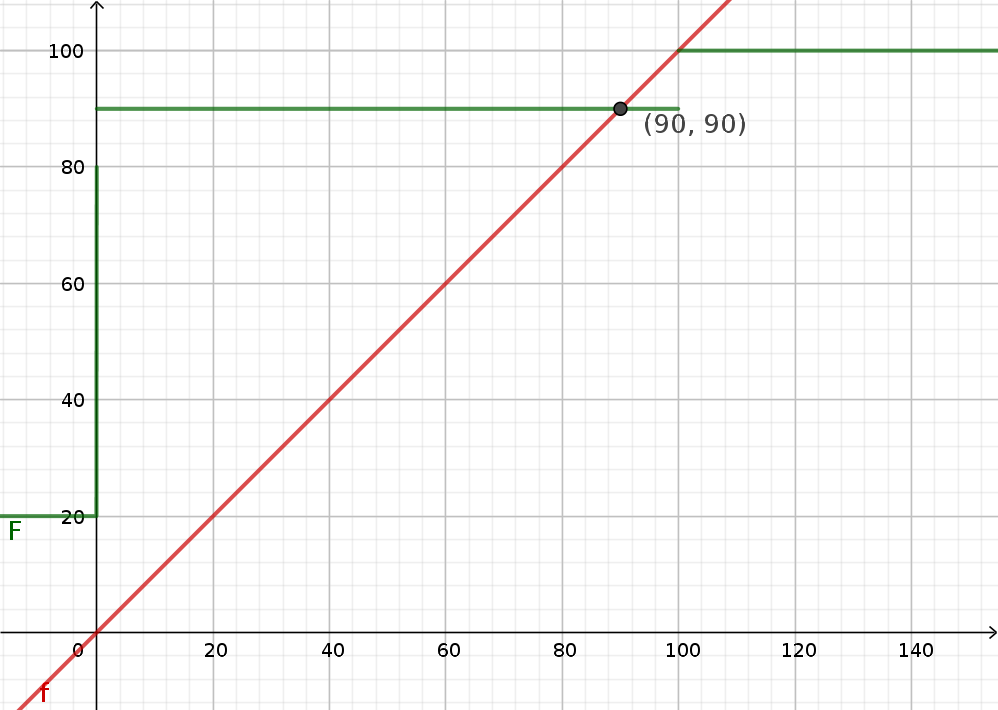

= Opgaver til M9

The following single-CPU-realtime system is to executed on a Real Time Operating System (RTOS) with preemptive FP scheduling and  immediate ceiling:

1. 4 alarms with mimimum interarrival time: 10 min., execution time 10 mS.
2. 1 user input with minimum interarrival time 1/4 sec. and mean interarrival time 2 sec., execution time 10 mS.
3. 1 network input with minimum interarrival time 10 mS, and mean interarrival time 10 sec., execution time 30 mS.
4. 1 real-time control of time critical system, sampling time 100 mS, execution time 10 mS.
5. 1 real-time control of time critical system, sampling time 1 sec. execution time 10 mS.
6. 1 screen clock, update frequency 1/10 1/sec.., execution time 20 mS.
7. User input and 2. realtime control share a common datastructure; accesstime 10 mS.

Suggest:

- Deadlines for all tasks
- A fixed priority order
- The use of aperiodic/sporadic servers for some tasks

Check feasibility of your design w.r.t. deadlines.

== Løsning

____
_Deadlines for all tasks_
____

- *T1* det er vigtigt at den handle hurtigt på denne alarm.
    Derfor skal den have 50 mSec.
- *T2* dette er rimelig soft, så derfor behøver man ikke en meget lav deadline.
    Her kunne man lade deadline være 1.2 sekundter.
- *T3* dette er igen soft men det kommer ret hurtigt.
    Event kan events komme ret hurtigt så en deadline på 0.3 s vil give mening.
- *T4* vil have en deadline samme som periode på 100 ms.
- *T5* vil have en på 1 sec.
- *T6* vil have en på 10 sec.

____
_A fixed priority order_
____

Her er der flere der har deadlines under period, så derfor vil DMA give mening.

(T1, T4, T3, T5, T2, T6)

____
_The use of aperiodic/sporadic servers for some tasks_
____

*T3* og *T4* giver mening at køre med _sporadic server_ eftersom de har en minimum interval time.

____
_Check feasibility of your design w.r.t. deadlines._
____

Her regner jeg completion time ud for hver task.

----
C1 = 10
----

Dette er feasable.

----
C4 = 10 + ceil(C4/(1000 * 60 * 10)) * 10
----

Denne er feasable da 20 ms er under deadline og næste periode.

----
C3 = 30 + ceil(C3/(1000 * 60 * 10)) * 10 + ceil(C3/100) * 10
----

Her kan man se at den ikke er færdig før min, så der kan komme queing.
Tilgengeld er den højere end mean periode, så derfor må den komme på plads efter noget tid.

----
C5 = 10 + ceil(C5/(1000 * 60 * 10)) * 10 + ceil(C5/100) * 10 + ceil(C5/(10*1000)) * 30 + 10
----

Denne er også feasable.

----
C2 = 10 + ceil(C2/(1000 * 60 * 10)) * 10 + ceil(C2/100) * 10 + ceil(C2/(10*1000)) * 30 + ceil(C2/1000) * 10
----

Dette er også feasable.

----
C6 = 20 + ceil(C6/(1000 * 60 * 10)) * 10 + ceil(C6/100) * 10 + ceil(C6/(10*1000)) * 30 + ceil(C6/1000) * 10 + ceil(C6/2000) * 10
----

Dette er også feasable

