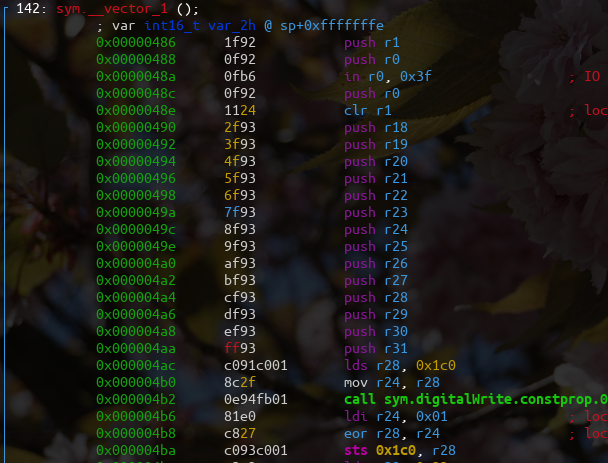

:stem:

== J1 module 1

____
Show code and explain for 1,4,5,6 (design and impl ISR, time based
debouncing, tick routing, limitations)
____

TODO med arduino. Og debouncer.

== Opgave løsning

____
_Design and implement an interrupt service routine which acts on digital pin 2._
____

Digital pin 2 i arduino er mapped til atmega328p pin PD2, og er koblet på INT0.
Derfor starter vi med at enable INT0.

Se for kode ../m1/int/int.ino

----
EIMSK |= 1 << INT0;
----

Derefter kan man lave en interrupt der trigger på rising edge, hvilket man ud
fra datasheet kan se er ISC01 og ISC00 i EICRAfor INT0.

----
EICRA |= (1 << ISC01) | (1 << ISC00);
----

Hvis man har sat den rigtige pinmode på 2, vil interrupten nu være aktiveret.

----
ISR(INT0_vect) {
    do_the_thing();
}
----

Her bruger jeg en normal ISR, hvor gcc håndtere det med at push registre på
stakken og sætte dem tilbage igen efter.

Dette kan man også se i den compilede fil.

____
_Or add a timed decision in ISR to prevent more ISR response for the nex xx mseconds._
____

Dette er gjort ved at gemme tiden for hver gang den kører med millis.
Derefter kan man check om det er over 100 ms siden at man sidst kørte.

____
_Design a tick routing which can run a function on given times (and explain code below_
____

Har lavet en function man kalder for hver tasks man vil tick route.
Denne bruger millis() funktionen som bagved bruger timer0.

____
_What is limitations ? like timewise  starvation,..._
____

Man kan tydelig se problemet hvis man sætter task0 til at have et 10000 ms langt
delay.

Her vil man se starvation i at det hele bliver langsomere.

Dette er fordi det ikke er preimtive hvilket betyder at hvis et job bare tager lang
tid må de andre bare vente.

=== Noter

Findes forskellige slags realtime afhængig af hvor vigtigt det er at man
laver sin opgave inden for deadline.

* *Hard* er når en manglende deadline tæller som en system fejl.
* *Firm* nogle deadlines på gerne misses, men disse resultater vil være
ubrugelige.
* *Soft* et resultat er ikke nær så meget værd hvis det er forsent, men
kan stadig bruges.

== H1 module 2

____
Exercise 1-11
____

=== Løsning

See ../emb_m2/emb_m2.ino

____
_Compute the mean relative error between da and mda_
____

0.0052564806 hvilket er okay for at den kun er 16 bit.

____
_Compute the mean relative error between da2 and mda2_
____

0.1998619556 her kan man se at fejlen stiger en del.

____
_Iterate "a*=da[i];" over the length of da and measure the execution time (micros())_
____

Exe time: 1272

____
_Iterate "mult_float(&f1,&mda[i],&f); memcpy(&f1,&f,2);" over the length of mda and measure the execution time_
____

Exe time: 828

____
_Compute the relative difference between results from (7) and (9)_
____

----
Abs diff: 444
Rel diff: 0.35
----

____
_Implement the fastest version of the trigornometric function "sine" that has below 2% relative error._
____

Her brugte jeg tayler til at exporimere sin(x).
Dette blev ret præcis men var meget langsomere end sin(x).

----
TOTAL STATS
rel err : 0.0005467962
own time: 2420
ard time: 134
----

=== Noter

*Q-format* er hver man dedikere nogle af bits til decimaler. Det er
derfor ikke _floating_ point.

*Floating points* er decimal tak med en floating point. Her har man kun
et bestemt tal betydende cifre.

TODO læs op på error calculus. Totalt uforståeligt i slides.

Der findes forskellige måder at have negative tal på.

* Signed Her bruger man MSB til at betyde sign. Når den er 1 er det et
minutal. Problemet er at der nu er 2 nuller.
* 1’s komplement Ligesom _signed_ men når det er negativt er alle bits
flippet. Dette gør det meget lettere at lave matematik på det. Her er
stadig det problem at der er 2 nuller.
* 2’s komplement Ligesom _1.s komplement_ men negative har 1 lagt til.
Dette betyder at der kun er 1 nul værdi.

== H2 module 3

____
Exercise 4-7
____

=== Løsning

Her har jeg lavet noget test data med to beskeder, dette løser den ret godt.

Jeg bruger bare uint8_t til de to først typer.

Se ../m3/m3.ino

----
DONE
Type            :1
Recvid          :514
Transducerlevel :88
Quiettime       :50
Masters         :1

MASTER: 0
    rssi        :90
    txid        :5
    ixidtime    :600
DONE
Type            :65
Recvid          :1
Transducerlevel :136
Quiettime       :16
Masters         :3

MASTER: 0
    rssi        :23
    txid        :68
    ixidtime    :65535

MASTER: 1
    rssi        :11
    txid        :171
    ixidtime    :65534

MASTER: 2
    rssi        :3
    txid        :64
    ixidtime    :65535
----

=== Noter

To forskellige hoved protokoller.

* ASCII Let at læse at læse for en person. Det er nemmere at seperere
felter. Bare ikke særlig efficient.
* Binary Inviklet af seperere felter, da data felter kan indeholder
delimiters. Mere efficient.

Findes fire forskellige structurelle elementer.

* Sequence Flere elementer efter hinnanden.
* Alternation Enten den ene eller anden type element.
* Repetition Lister af det samme elemtn
* Abstraction Structure og egne data typer.

*Haming distance* er hvor mange bits er forskellige mellem to bit
sekvenser.

*Haming distance of protection code* hvor langt der er imellem to
sekvenser der stadig er korrekte. Dette kan man kande for _HD_.

* Hvis _HD_ er større end _n_ kan man detect _n_ bit errors.
* Hvis _HD_ er større end _2n_ kan man fixe _n_ bit errors.

Fletcher _HD_ er 2 så man kan detect en bit fejl.

== J2 module 4

____
Show LED13 blink code and explain program.
____

Se ../emb_m4/emb_m4.ino

____
Explain interrupt
____

Se ../emb_m4/jrnl/jrnl.ino
Se ../m1/int/int.ino

____
Lack of control maybe bq of non-interruptable ISRs
____

____
Procesmodel: running,ready,blocked
____

Man kan se at processorne bruger k_sleep, hvilket gør dem blocked.
Når de er færdige med at sleep kommer de i ready, og når de så bliver scheduled
kommer de i running.

____
semaphore wait and signal
____

Dette kan man bruge til forskellige ting.

Critical region::
    Man har noget kode der tilgår noget data.
    Dette kan man låse ved at lave en semafor med en start værdi på 1.
    Når nogen låser den tager de den værdi.
Periodisk timing::
    Man kan sætte os til at signal ens semafor hvert x sekundt.
    Her giver man start værdi 0.
Timing og beskeder::
    Det er en god måde at synkronisere forskellige task.
    For eksempel kan en ISR sætte en semafor for at signalere at der er en ny besked.

== J3 module 5

____
What is a semaphore, show code from above and eplaing critical region
setup
____

Se ../m5/m5.ino

== J4 module 6

____
Show code for and explain message queues as a buffering tool.
____

Se ../m6/m6.ino

== J5 module 6.5

____
Exercise 1 in part3 on page295 (Pdf is on moodle)
____

== H3 module 7

____
Exercise 4-5
____

Se ./M7opg.adoc

TODO lav arduino opgaver. TODO lav måske lidt flere af opgaverne.

=== Noter

*Scheduling* er når flere opgaver eller jobs skal time shares på en CPU.
Et *Schedule* er plan for hvordan disse opgaver skal have tid. Et
schedule er *feasable* hvis alle jobs kan køres imellem deres readytime
og deadline.

Der findes forskellige kategorier.

* Fixed schedules Jobs kører på tidspunkter man har bestemt for forhånd.
Og dette kører bare i loop. Dette er ret simpelt og effektivt men ikke
særlig fleksibelt.
+
Her behøver man kun lave en plan hen til LCM eller Least Common Multiple
af tasks periods.
* Round robin Fixed tidsrum er delt ud mellem jobs periodisk. Simpelt og
fleksiblet men ikke effekttivt.
* Fixed priority Det er altid jobbet med højeste prioritet der kører.
Dette er simpelt og fleksibelt, men kun middelt effektivt.
* Dynamic priority Her bruger man andre regler til at bestemme hvem der
kører. Dette giver de bedste resultater men er også mere komplekst.

Utilization er _completion time_ dividere med _period_. Man kan definere
CPU utilization som:

stem:[U = \sum_{i=1}^N \frac{c_i}{T_i}]

_Rate Monotonic Scheduling_ eller *RMA* er når man giver task med lav
periode højere prioritet.

_Deadline Monotonic_ eller *DMA* sortere efter laveste relative
deadline. Dette giver det samme som RMA hvis relative deadlines er lig
periode. Hvis deadline er før periode giver den optimale resultater.

_Utilization critereon_ er en upper limit stem:[\overline{U}] for
utilization hvor RMA er garanteret hvis deadlines er lig periode.

stem:[\overline{U} = N \cdot (2^{\frac{1}{N}} - 1)]

== H4 module 8

____
Exercise 1-2
____

Se ./M8opg.adoc

TODO lav arduino ting

=== Noter

_Earliest Deadline First_ eller *EDF* er hvor man tager den med deadline der er
tættest på _t_.

Dette gør man dynamisk hvilket giver en højere runtime cost end en fixed priority såsom *DMA*.

_Hvis man kan finde et feasable schedule er *EDF* også feasable._

_Hvis deadlines er lig perioder er taskset schedulable med *EDF* hvis stem:[U \leq 1]._
Dette kaldes også for *utilization criterion.

*Priority Ceiling*, er hvis en task stem:[\tau] prøver at lock en locked task, arver stem:[\tau{}_l] prioriteten.
Her er det først når en højere task prøver at lock at den lavere task arver.

Dette har forskellige egenskaber, hvis man kan garantere at alle task laver nested locking.

- No deadlocks possible
- En task venter max duration af critical region for lavere task.

*Immediate Ceiling* er mere leightweight, da man istedet siger at hvis en task
locker en lock, vil den arve den højst mulige potentielle perioritet.
Også selvom der ikke er nogen der venter på den.

Denne har samme egenskaber men behøver ikke lige så meget overhead.

I et non-preemtive system, vil dette ikke betyde så meget, da ressources bliver
unlocked igen i execution perioden for en task.

Hvis man har _round_robin_, _static_ eller _dynamic_ scheduling er der ikke nogle prioriteter man kan bruge.
Derfor bruger man _Static Ressource Priority Ordering_ hvor man bruger priorities når der sker ressource locking.

- Hvis man bruger _static priority_ bestemmer man STPO før.
- Hvis man bruger _round robin_ her kigger man på worsk case analysis.
- Hvis man bruger _EDF_ her det svært at lave analysis.

== H5 module 9

____
All exercises
____

Se ./M9opg.adoc

=== Noter

Er *System* kan deles ind i *subsystemer* som igen kan deles ind i *objects*.

_Subsystems_ deler de forskellige *terminators* op, hvor en termiator er noget
der snakker med omverdenen.

Et subsystem kan være en server hvilket betyder at den ikke selv laver request,
men kun modtager.

_Objekter_ kan have forskellige typer:

- IO
- User role
- Control
- Data abstraction
- Algorithm

Man kan forklare et subsystems opførsel med *STD*(State Transistion Diagram).

Når man laver et event kan det gøres på forskellige måder.

Triggering:: Sender en commando som man derefter venter på (blocking).
Enabling:: Sender en commando som bliver startet i baggrunden (unblocking).
Disabling:: Stop en commando der blev enabled.

