# Opgave til Tema 8

Her vil jeg løse to opgaver.

- Convince visitation of URL
- Program Behaviour

## Convince Visitation of URL

> This is he first challenge regarding Cryptobanker.
> You have to convince the CEO to visit some website - the website has to actually exists.
> Fortunately he has a dentency of clicking on anything containing http://

Teksten afslører at CEO af Cryptebanker åbne alle http links han kan finde.
Eftersom dette er målet af opgaven, er målet derfor at sende CEO'en en besked.

For at vide mere om CEO'en åbnes cryptobanker hjemmesiden.

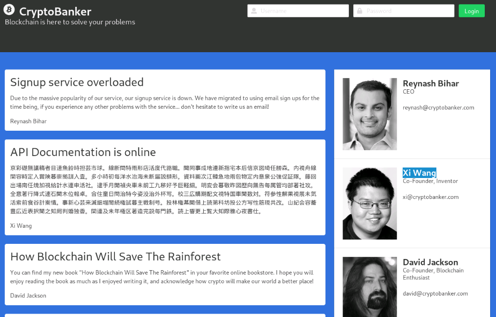

Her kan man se at CEO'en hedder Reynesh Bihar, og hans email er givet.
En email vil være en god måde at få ham til at trykke på et link,
men for at være helt sikker skal mailen sendes fra en han stoler på.

Derfor vil målet være at sende et link til Reynesh Bihar fra Xi Wang's mail adresse.

Først skal man have en webserver man kan link til og her er kan man bruge php's indbyggede webserver.

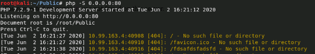

Derefter skal Cryptobankers mail server findes.
Her bruges tit `mail.example.com` så derfor scannes `mail.cryptobanker.com`.

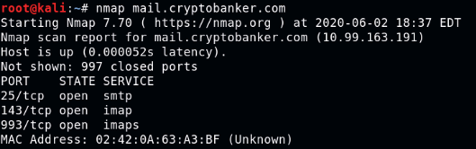

Her kan man se at serveren er online, og at den har porte åbne der passer med at det er en mailserver.
Derfor kan man sende en mail ved at lave en simpel TCP forbindelse og følge SMTP protokollen.

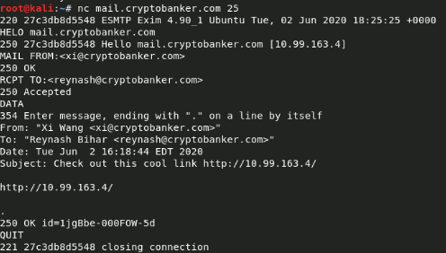

For en sikkerheds skyld er mail i emne og tekst.
Lige efter mailen er sendt kommer der et HTTP request ind på php test serveren
med et flag.

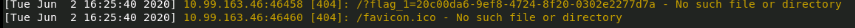

## Program Behaviour

> This is a simple reverse engineering challenge in which the user has to find the hidden flag into a binary file.
> The main goal is to let understand the user how to crack a program in order to change its behaviour.
> It will be necessary to use a debugger tool to analyse and understand the workflow on the program. `FTP credentials = username=user | password=haaukins`

Først logges der ind på ftpserveren i firefox.

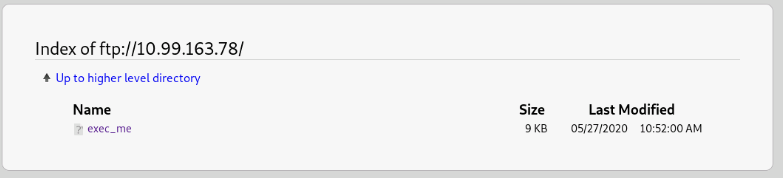

Her kan en eksekver bar fil hentes ned.
Når man kører den spørger den den efter en ukendt license key.

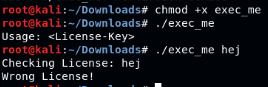

Da den checker efter key må metoder for at checke keyen være i programmet.
Dette kan man gøre to måder:

- Køre programmet og kig på det den laver i en debugger.
- Undersøg programmet uden at køre den.

Den sidste metode vil blive brugt her, og programmet radare2 er brugt.

Først checkes hvad for en slags fil det er.

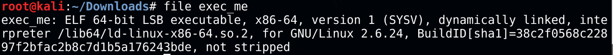

Her kan man se at det er et 64bit executable, som ikke er blevet stripped.
Dette betyder at funktion og variabel navne stadig er intakte.

Nu åbnes den i radare2 og `aaa` køres for at lade radare2 lave statisk analyse
på programmet.
Derefter køres `afl` for at liste funktioner i programmet:

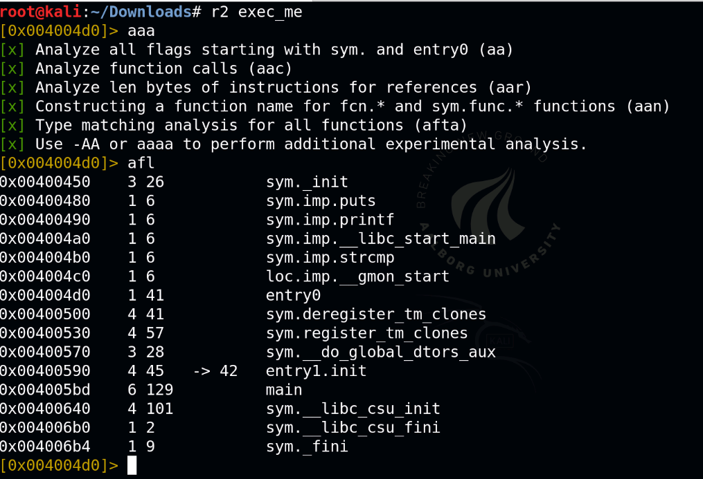

Her er `main` interessant da det er der c programmer starter.
Alt før er forbedreelse for at starte programmet.
Derfor disassembles main funktionen.

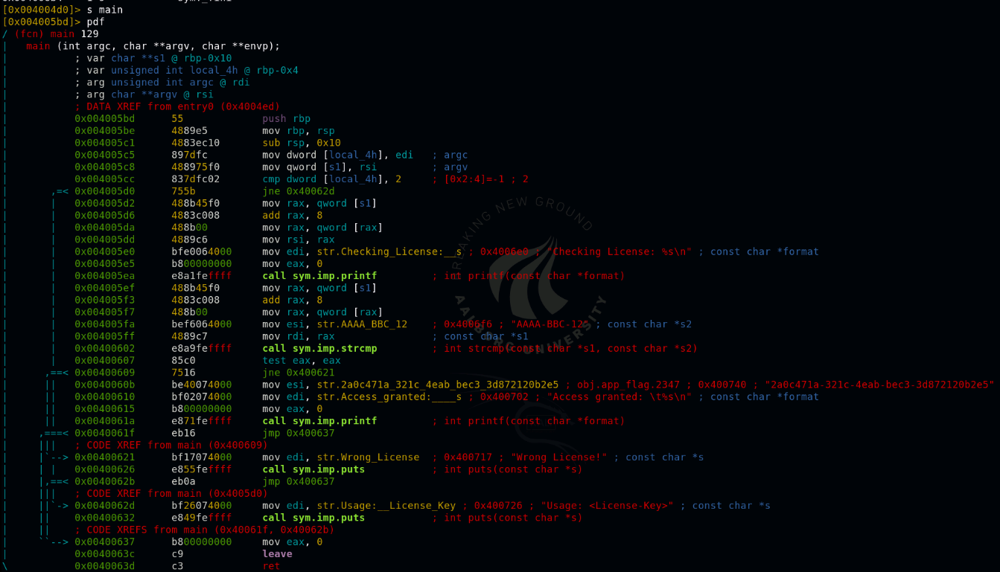

Her kan man se at ved `0x00400602` laver den en string compare med input og
en string `AAAA_BBC_12`.
Derfor kan man prøve den som licens nøgle.

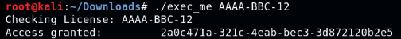

Efter at prøve det givne flag er det rigtigt.
Dette flag kunne man også have fundet ved at kigge lidt længere ned i disassembly koden.
`0x0040060b` indeholder samme flag.

Eftersom alt er gemt i normale c strings kan man også bare læse flaget ud med `strings` programmet.

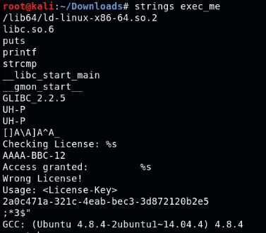
