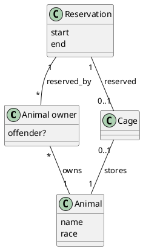

# Opgaver til OOP M2

```
2020-09-10:s5/oop/mm3/opg/1 #f40e/G
```

## Opgave 1 - Usecase diagram

```plantuml
left to right direction
actor "Animal owner" as ao
actor "Database" as db

package "Animal hotel" {
    usecase "Make reservation" as umr
    usecase "Check info" as uci
    usecase "Host animal" as uha
    usecase "Return animal" as ura

    (umr) .> (uci) : <<include>>
    (uha) .> (uci) : <<include>>
}

ao --> umr
uci --> db
ao --> uha
ao --> ura
uha --> db
ura --> db
```

## Opgave 2 - Requirements

Functional:
- Must validate and check user info.
- Keep track of available space.
- Store animals.
- Respect special food requirements.

Usability:
- Easy to use GUI as it's going to be used by Animal owner.

## Opgave 3 - Domain model


